# NTUOSS Pandas Basics Workshop

*by [Wilson Thurman Teng](https://github.com/wilsonteng97) for [NTU Open Source Society](https://github.com/ntuoss)*

This workshop features a hands-on approach to learning the basics of [Pandas](https://pandas.pydata.org/pandas-docs/stable/), [Matplotlib](https://matplotlib.org/tutorials/index.html), [Seaborn](https://seaborn.pydata.org/introduction.html?highlight=jointplot) & [Scikit-learn](https://scikit-learn.org/stable/tutorial/index.html). Familiarity with Python syntax or programming data types (e.g.integer,float,etc) would be useful but not required to complete this workshop.

**Disclaimer:** *This document is only meant to serve as a reference for the attendees of the workshop. For a full, comprehensive documentation of the python libraries discussed, please check the official documentations linked above.*

---

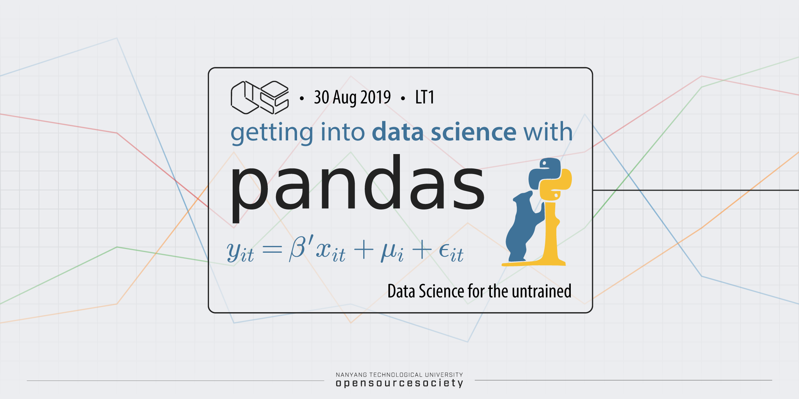
*Artwork by [@hyde-brendan](https://github.com/hyde-brendan)*

### Workshop Details
**When**: Friday, 30 Augusts 2019. 6:30 PM - 8:30 PM.</br>
**Where**: LT1 Nanyang Technological University</br>
**Who**: NTU Open Source Society

### Questions
Please raise your hand any time during the workshop or email your questions to [me](mailto:wilsonteng89@gmail.com) later.

### Errors
For errors, typos or suggestions, please do not hesitate to [post an issue](https://github.com/wilsonteng97/NTUOSS-PandasBasics/issues/new)! Pull requests are very welcome, thank you!

___

## 1. Introduction

This workshop is primarily about getting yourselves started with Data Analysis. We will begin by covering some background on why pandas, then move on to how to get it running on [Google Colab](https://research.google.com/colaboratory/faq.html) and then finally cover some of the basic commands which you'll be using when working with Data Analysis.

Since this is a basic workshop, we'll walk you through the setup phase for colab.

### 1.1 Google Colaboratory

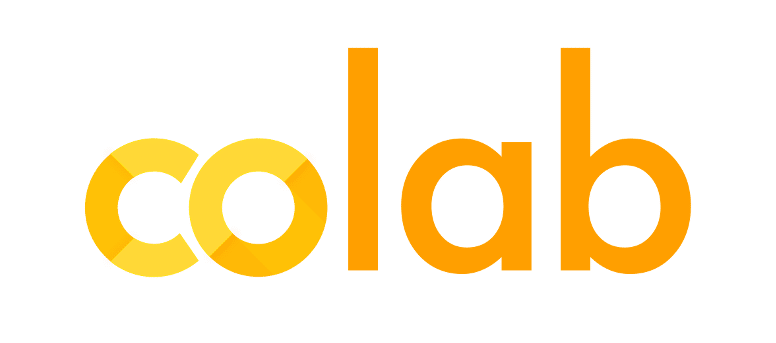

Colab is a free Jupyter notebook environment that requires no setup, and runs entirely (writing, running, & sharing code) on the Cloud. For those of you familiar with Jupyter Notebooks, you can think of colab as a Jupyter Notebook stored in Google Drive. A typical notebook document is composed of cells, each of which can contain code, text or images.

### 1.2 Setting up Google Colab

1. Create a gmail account (if you do not have one already).	
2. Find and click on "HDB_ResalePrices.ipynb".
3. Select "Open with", select "Connect more apps".
4. Search for "colab", press "Connect".
5. Select "Open with Google Colaboratory".
6. Drag the 3 files from Data into Google Colab
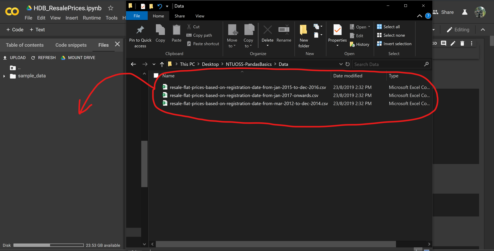

### 1.3 Data Science Process

Data Analysis typically involves the following steps:
1. Problem statement/shaping
> A Data Science Project should be business oriented. Problem statements/shaping should be done with the intent of achieving results.Can you relate the problem to data? Would data help you in practice? 
2. Data Collection
> Collect relevant data that matches the problem.
3. Data Cleaning/Processing
> Some common errors in data to lookout for are missing/corrupted values, datatype mismatches.
4. EDA(Exploratory Data Analysis)/Visualization
> Find patterns in your data and compute vital statistics (e.g.Mean,Median,Standard deviation,etc)
5. Data Modelling
> Split your data in train and test sets. Create a machine learning model from your training set for prediction.
6. Data Evaluation
> Evaluate your model using a suitable metric (e.g.Mean squared error,f1 score,etc) and try to improve the score that metric.

## 2. HDB Resale Prices Example
*Dataset taken from [Data.gov.sg](https://data.gov.sg/group/infrastructure)*

Now that we've discussed the Data Science process, let's dive into our example.

### 2.1 Import Libraries

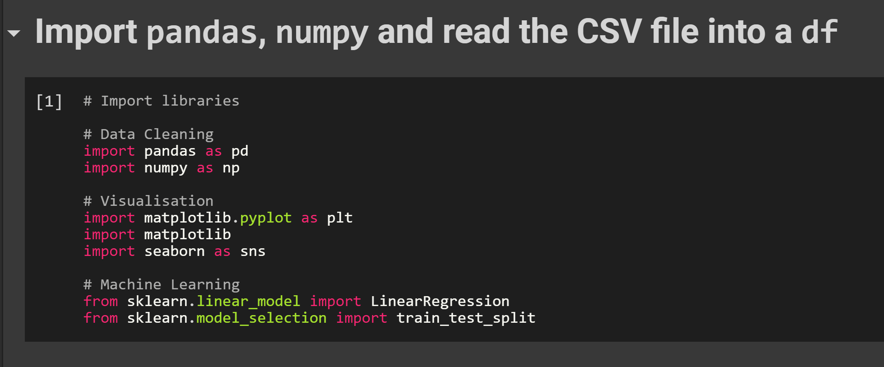

#### 2.1.1 For Data Processing/Cleaning
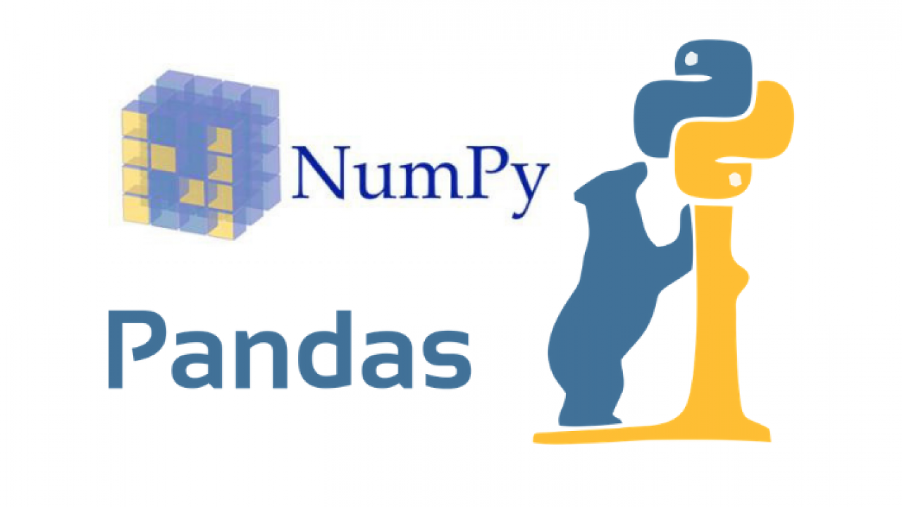
[Pandas](https://pandas.pydata.org/pandas-docs/stable/) is typically used for data manipulation & analysis and is highly optimized with critical code paths written in Cython or C++.
[Numpy](https://www.numpy.org/) is used to manipulate large, multi-dimensional arrays and matrices, which is very useful for processing data for Data modelling.

#### 2.1.2 For Visualization

[Matplotlib](https://matplotlib.org/tutorials/index.html) is a multi-platform data visualization library built on NumPy arrays. 
[Seaborn](https://seaborn.pydata.org/introduction.html?highlight=jointplot) is based on matplotlib. It provides a high-level interface for drawing attractive and informative statistical graphics.

#### 2.1.3 For Machine Learning
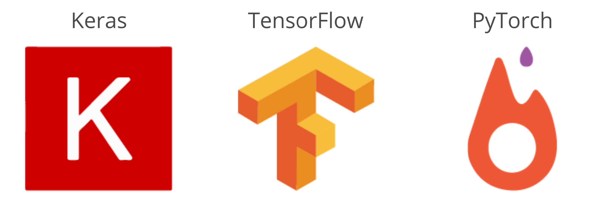
[Scikit-learn](https://scikit-learn.org/stable/tutorial/index.html) provides a range of supervised and unsupervised machine learning algorithms.
[Extra: Keras](https://keras.io/) is a high level API typically used for rapid prototyping on small data sets.
[Extra: Tensorflow](https://www.tensorflow.org/) is a framework that provides both high and low level APIs and is typically used on large data sets because of it's high performance.
[Extra: Pytorch](https://pytorch.org/) is lower-level API focused on direct work with array expressions. It has gained immense interest recently, becoming a preferred solution for academic research, and applications of deep learning requiring optimizing custom expressions.

### 2.2 Reading data into Dataframe format
Before we can do any Datascience work, we must convert the data we want to analyse into a Dataframe object. In this case, our data is in the `.csv` format.
```bash
df_variable_name = pd.read_csv('PATH OF FILE')
```
### 2.3 Data Cleaning/Processing 

Now we are ready to clean our data!

#### 2.3.1 Concatenating separate data frames
Sometimes, you may get your data separated into multiple files although they have the same formats. This is especially common since the limit for excel is 1,048,576 rows and datasets are typically very large, especially with deep learning becoming more popular.
```bash
frames = [df_variable_name_1, df_variable_name_2, df_variable_name_3]

df_variable_name = pd.concat(frames, ignore_index=True, sort=False)
```
#### 2.3.2 Remove features unnecessary for your problem
After exploring your data, you may want to remove features that do not contribute to your problem, and are hence unnecessary.  Removing features from your dataframe helps to prevent cluttering and allows you to save memory.  
```bash
df_after = df_before.drop(['feature_to_drop_1', 'feature_to_drop_2', 'feature_to_drop_3', 'feature_to_drop_4'], axis=1)
```
#### 2.3.3 Remove NaN values from Dataframe
Within Pandas, a missing value is denoted by `NaN`.
You can either choose to remove rows which contain `NaN` datapoints or replace these values. For example, replace it with the result of a function of the other numerical features. This will be highly dependent on the context of your problem.
For the purpose of this workshop, we will remove the `NaN` values.
```bash
df_after = df_before.dropna()
```
#### 2.3.4 Sorting Dataframe
For ease of analysis, you may want to sort your dataframe according to a few features. For the example below, the order of sorting will be the following:  `['feature1', 'feature2', 'feature3', 'feature4']`
```bash
df_after = df_before.sort_values(['feature1', 'feature2', 'feature3', 'feature4']).reset_index(drop=True)
```
#### 2.3.5 Changing dtype of features to better suit context of Dataset
Before we continue, this is a overview of the common datatypes you will encounter in Pandas. To find out more, [check out the official Pandas Documentation](https://pandas.pydata.org/pandas-docs/stable/getting_started/basics.html#dtypes).
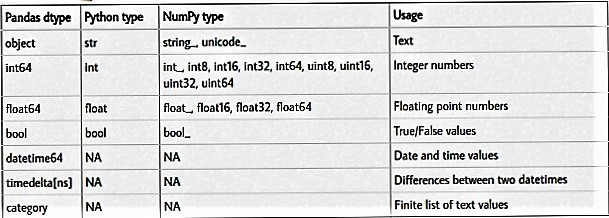
We will first have to find out the datatype for each feature in the dataframe. This can be done using the `.info()` method or the `.dtypes` function.
```bash
df_to_check.info()
```
```bash
df_to_check.dtypes
```
Next, dictate the feature and the datatype you want to convert to. If there are no errors, the datatypes you want to convert to is compatible and conversion is successful.
```bash
df_after = df_before.astype({'feature1':'Datatype_you_want_to convert_to', 
                             'feature2':'category', 
                             'feature3':'category', 
                             'feature4':'category',
                             'feature4':'int64',
                             'feature5':'int64'})
```
Use the `.info()` method or `.dtypes` function to check that the datatype conversion is successful.
#### 2.3.6 Feature Engineering
Feature engineering is the process of transforming raw data into features that better represent the underlying problem to the predictive models, resulting in improved model accuracy on unseen data. Put simply, feature engineering turns your inputs into features the algorithm can understand and helps with your Data Modelling.
```bash
# Right-hand-side will be the function to create the engineered feature.
df['name_of_engineered_feature'] = df['feature1'] - df['feature2']
```
The code above will create a new feature column.

**Extra: using a function to create an engineered feature**
```bash
# Define a function to determine if resale_price of house was expensive
def expensive_category(df):
	if df['resale_price']>500000:
		return 1;
	else:
		return 0;
```
Use the `.apply()` method to create your engineered feature.
```bash
# df['name_of_engineered_feature'] = df.apply(function_to_apply)
df['expensive_cat'] = df.apply(expensive_category)
```

### 2.4 Visualization 
Data visualization helps to encode data into visual objects (Lines, Points, Bars, etc). This helps you to understand your data better as well as communicate this information more efficiently to stakeholders.
#### 2.4.1 Using Matplotlib/Seaborn for Uni-variate Analysis
Uni-variate Analysis refers to the analysis of only 1 variable at a time.
##### 2.4.1(a) Boxplot 
The `orient` argument gives you the flexibility to change the orientation of the Boxplot. In this example, the `"h"`(Horizontal) orientation is specified. 
Try changing it to `"v"`(Vertical)!
```bash
import seaborn as sns
sns.boxplot(df['variable_you_want_to_analyze'], orient="h")
```
**Understanding a Boxplot**
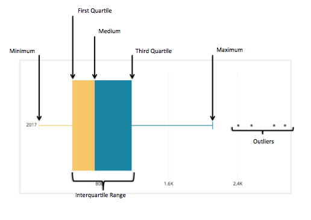
##### 2.4.1(b) Distplot 
This will draw a histogram and fit a [kernel density estimate (KDE)](https://mathisonian.github.io/kde/).
```bash
import seaborn as sns
sns.distplot(df['variable_you_want_to_analyze'], color='r')
```
**Understanding KDE**
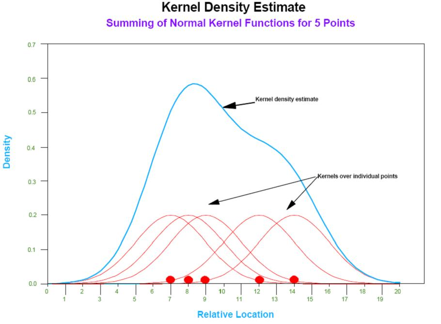
##### 2.4.1(c) Violinplot 
A Violin Plot is used to visualize the distribution of the data and its probability density. It is the combination of a Boxplot and a KDE Plot that is rotated and placed on each side, to show the distribution shape of the data.
```bash
import seaborn as sns
sns.violinplot(df['variable_you_want_to_analyze'])
```
**Understanding a Violinplot**
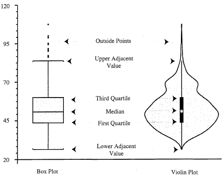
##### 2.4.1 *Extra: Grouping graphs together*
You may want to group your graphs together for easier analysis.
```bash
# f, axes = plt.subplots(`rows`, `columns`, figsize=(`width`, `height`))
f, axes = plt.subplots(2, 3, figsize=(20, 10))
```
The `plt.subplots` method returns a figure object , `f` and a 2D-array of axes object, `axes`. 
* `f` is the "canvas" you will be "painting" your graphs onto.
* `axes` is a 2D-array dependent on what you have specified for the `rows` & `columns` argument. In the example above, *axes = [[subplot_1, subplot_2, subplot_3], [subplot_4, subplot_5, subplot_6]]*
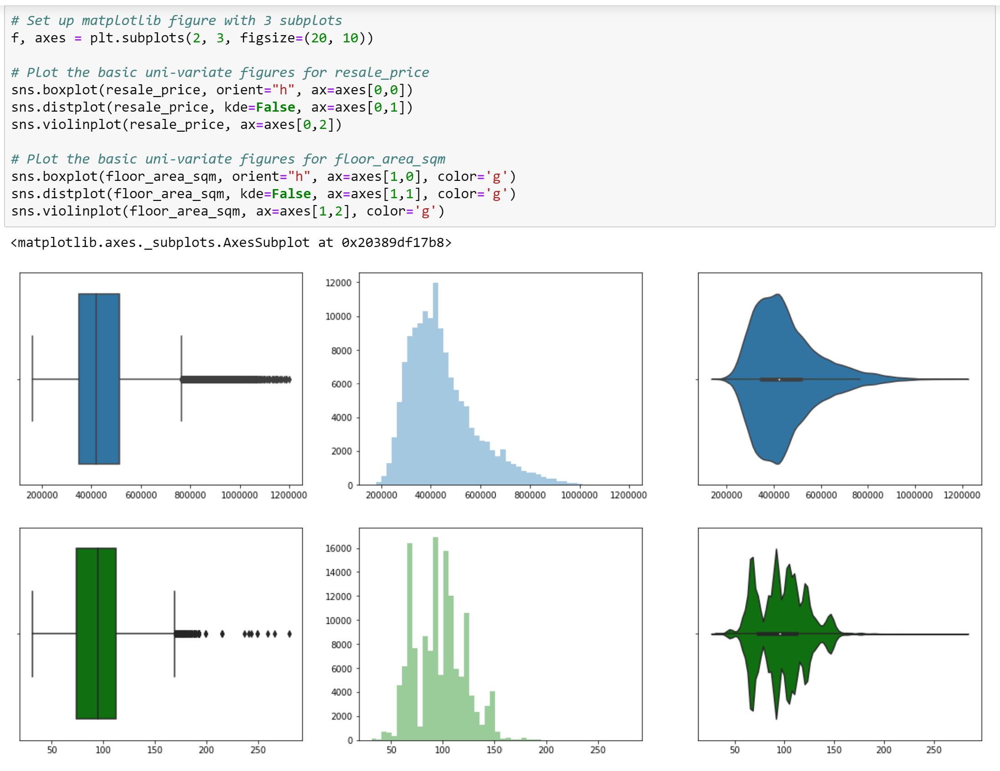

#### 2.4.2 Using Matplotlib/Seaborn for Multi-variate Analysis
It can also be useful to visualize a bivariate distribution of two variables. Multi-variate Analysis refers to the analysis of only multiple variables at the same time.  
##### 2.4.2(a) Jointplot
The easiest way to do this in seaborn is to just use the `.jointplot()` function. The jointplot plots the bivariate scatterplot and histograms.
```bash
import seaborn as sns
sns.jointplot(x='x_variable', y='y_variable', data=df,
              height=10, edgecolors='w')
```

##### 2.4.2(b) Heatmap
We can also use a heatmap to plot the correlations between 2 variables.
```bash
import seaborn as sns
jointDF = pd.concat([floor_area_sqm, resale_price], axis=1, join_axes=[floor_area_sqm.index])
sns.heatmap(jointDF.corr(), vmin=-1, vmax=1, annot=True, fmt=".2f")
```
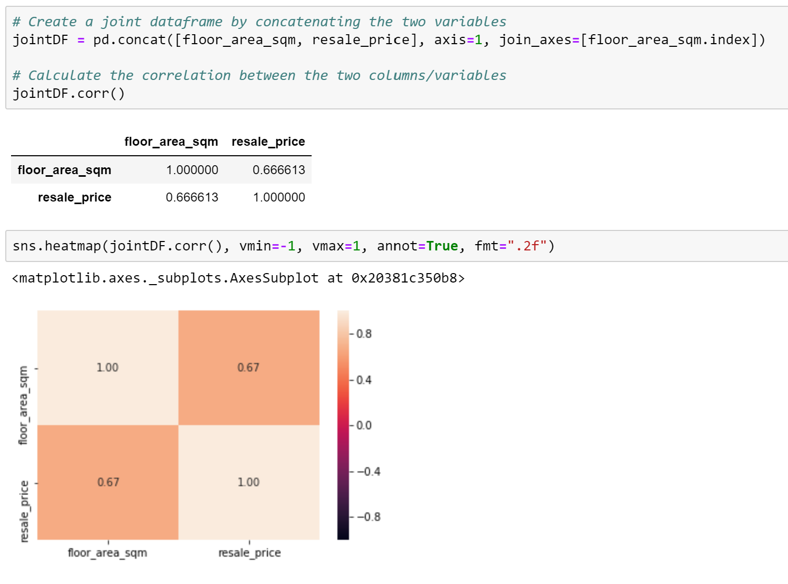

#### 2.4.3 Analyzing Categories
##### 2.4.3(a) Catplot
After converting some of our features into categorical datatypes to categories (as we have learnt above in 2.3.5), we can also do some analysis on them!
```bash
import seaborn as sns
sns.catplot(y='categorical_variable_name', data=df, kind="count", height=8)
```
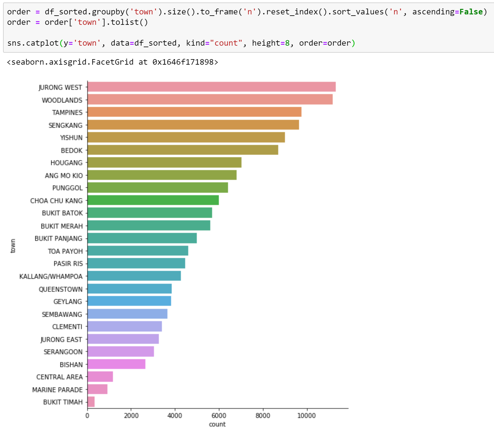

### 2.5 Data Modelling (Machine Learning)
#### 2.5.1 What is Linear Regression

Linear Regression is all about trying to find the best fit line for your datapoints. The intuition is to minimize the “Sum of Squared Errors” (SSE), which is the sum difference between actual value and predicted value.
The goal is to eventually generalize the dataset and predict the dependent variable with reasonable accuracy given the independent variable.
#### 2.5.1 Splitting our dataset in Train and Test sets
Before we begin Data Modelling, we have to split our dataset into train and test sets so we have a measure to evaluate our model's performance.
```bash
X = floor_area_sqm = df_sorted['floor_area_sqm'].values.reshape(-1, 1)
y = resale_price = df_sorted['resale_price'].values.reshape(-1, 1)

# Split the Dataset into Train and Test
X_train, X_test, y_train, y_test = train_test_split(X, y, test_size=0.2)

# Check the sample sizes
print("Train Set :", X_train.shape, y_train.shape)
print("Test Set  :", X_test.shape, y_test.shape)
```
**Explanation of code**
1. We first reshape our X and y to get a 1D-array. 
2. Next, we split our dataset into `X_train`, `X_test`, `y_train` and `y_test` with 20% of our dataset as the test set.
3. Lastly, we print out the shape of `X_train`, `X_test`, `y_train` and `y_test`.
#### 2.5.3 Visual Representation of the Linear Regression Model
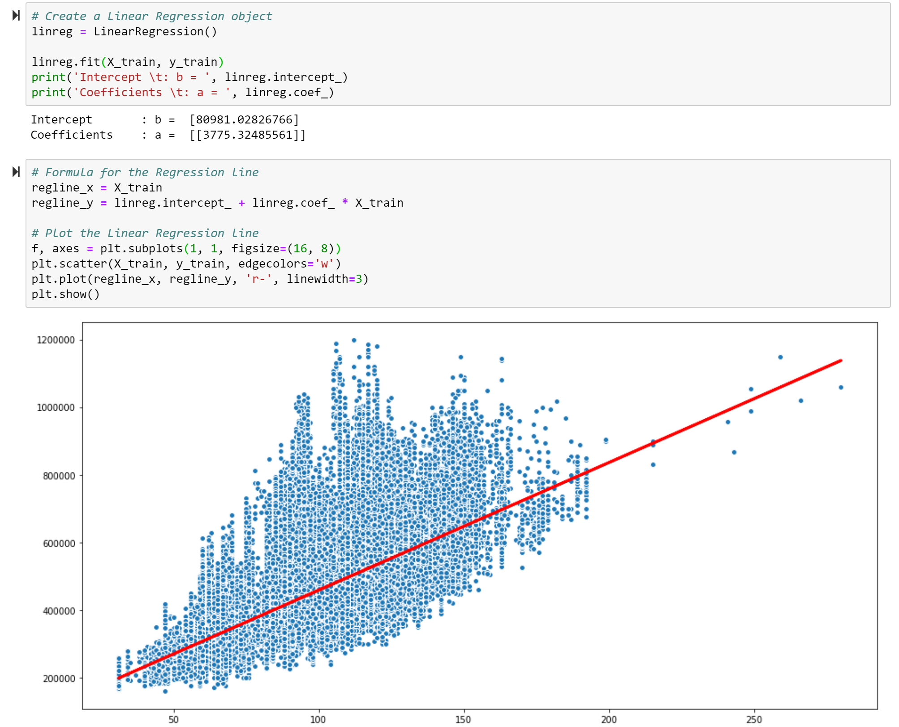
```bash
linreg = LinearRegression()
linreg.fit(X_train, y_train)

# Formula for the Regression line
regline_x = X_train
regline_y = linreg.intercept_ + linreg.coef_ * X_train

# Plot the Linear Regression line
f, axes = plt.subplots(1, 1, figsize=(16, 8))
plt.scatter(X_train, y_train, edgecolors='w')
plt.plot(regline_x, regline_y, 'r-', linewidth=3)
plt.show()
```
**Explanation of code**
1. We first create a LinearRegression Object `linreg`.
2. Then, using we fit our `linreg` object with our training set data — `X_train` and `y_train`.
3. Afterwards, we get the save the x-coordinates and y-coordinates of the `linreg` line into `regline_x` and `regline_y` respectively.
4. Lastly, we plot all the datapoints of the train dataset as well as the `linreg` best-fit line.

#### 2.5.2 Prediction of Response based on the Predictor
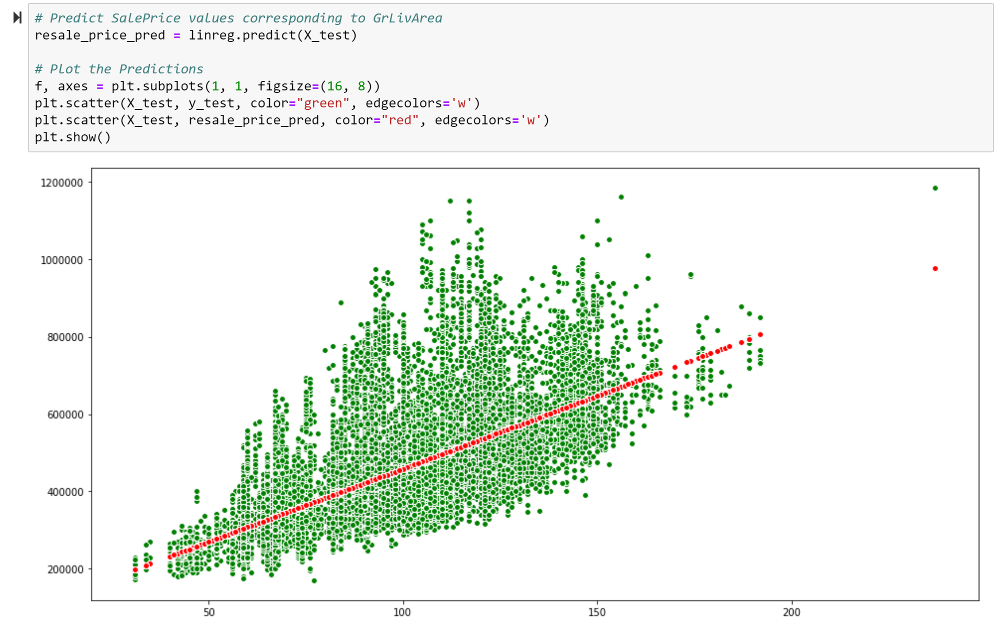
```bash
# Predict SalePrice values corresponding to GrLivArea
resale_price_pred = linreg.predict(X_test)

# Plot the Predictions
f, axes = plt.subplots(1, 1, figsize=(16, 8))
plt.scatter(X_test, y_test, color="green", edgecolors='w')
plt.scatter(X_test, resale_price_pred, color="red", edgecolors='w')
plt.show()
```
**Explanation of code**
1. We first save the predicted y-coordinates from `X_test` into `resale_price_pred`.
2. Next, we plot all the datapoints in the test set.
3. Lastly, we plot the resale_price that we have predicted from `X_test` using our best-fit line. 

## 3. Further Resources for learning
